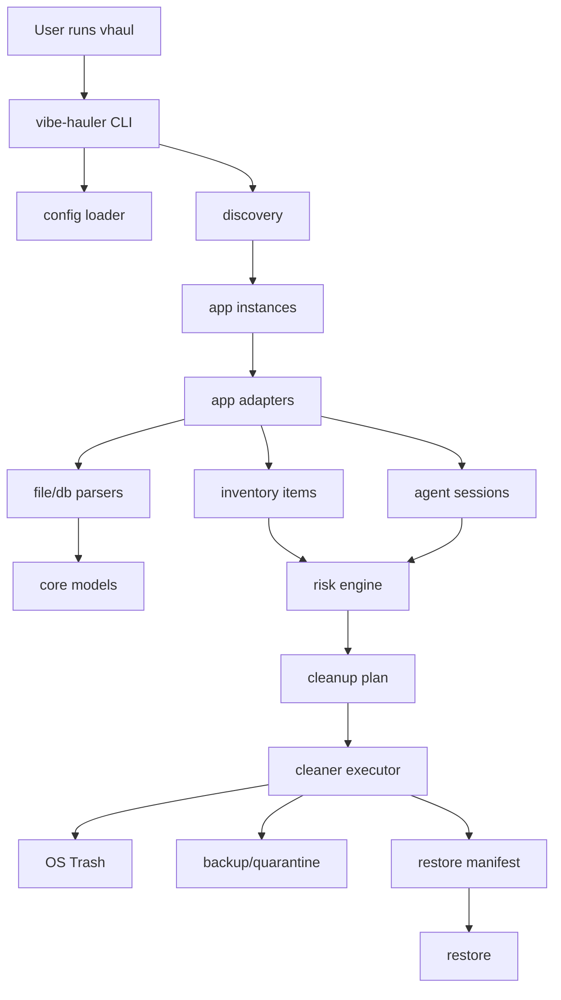

# System Architecture

VibeHauler is a Rust workspace made of small crates with one directional rule:

> CLI and adapters may depend on core contracts; core contracts must not depend on app-specific logic.

## High-level Flow



## Runtime Layers

| Layer | Responsibility | Must Not Do |
|---|---|---|
| CLI | parse startup flags, render TUI, ask confirmations | parse app data directly |
| Config | load defaults and user config | mutate cleanup targets |
| Discovery | find roots and app instances | classify cleanup risk alone |
| Adapters | app-specific inventory and session extraction | delete files |
| Parsers | parse JSONL, Markdown, SQLite, LevelDB, IndexedDB subsets | decide cleanup policy |
| Core | shared types, IDs, risk rules, plan generation | access the filesystem directly except abstracted metadata |
| Cleaner | backup, trash, quarantine, restore, manifest writes | infer app semantics |
| Redaction | mask secrets and private previews | delete or persist source data |
| Fixtures/Test | reproducible sample homes and snapshots | depend on real user homes |

## Dependency Direction

```txt
vibe-hauler (CLI)
  -> vibe-hauler-config
  -> vibe-hauler-core
  -> vibe-hauler-discovery
  -> vibe-hauler-adapters
  -> vibe-hauler-cleaner
  -> vibe-hauler-redaction

vibe-hauler-adapters
  -> vibe-hauler-core
  -> vibe-hauler-discovery
  -> vibe-hauler-parsers
  -> vibe-hauler-redaction

vibe-hauler-cleaner
  -> vibe-hauler-core
  -> vibe-hauler-redaction

vibe-hauler-parsers
  -> vibe-hauler-core
  -> vibe-hauler-redaction

vibe-hauler-core
  -> no VibeHauler crate dependencies
```

## Architectural Contracts

1. `InventoryItem` is about files, directories, DBs, and cleanup candidates.
2. `AgentSession` is about human-reviewable historical agent work.
3. `CleanPlan` is generated before mutation and can be saved to disk.
4. `CleanManifest` is generated after mutation and is the source of truth for restore.
5. `RiskLevel` is assigned by rules plus adapter evidence; adapters can recommend, but the core engine normalizes.
6. Paths are always represented as absolute normalized paths internally, with display shortening only at the CLI boundary.
7. Mutating TUI actions must be backed by a generated plan before execution.

## Filesystem-first Design

Runtime parsing priority:

```txt
Local filesystem
  -> JSON / JSONL / Markdown / TOML / YAML
  -> SQLite readonly + schema introspection
  -> LevelDB readonly + Chromium localStorage decoding
  -> IndexedDB raw scanner + bounded V8 subset deserializer
  -> Electron userData inventory
  -> VS Code/Cursor state.vscdb key-value parser
  -> user-provided backup/export JSON
```

External SDKs and upstream CLIs are research inputs only. They may be used to generate fixtures or understand schemas, but the `vhaul` TUI must not require them.

## Error Strategy

| Case | Behavior |
|---|---|
| Unknown JSONL event | keep raw count, warn, continue |
| SQLite schema changed | emit schema report, keep DB Red/Black |
| LevelDB locked | mark Black and suggest closing app |
| IndexedDB subset parse fails | report candidate objects and fallback paths |
| Missing timestamp | fallback to metadata mtime |
| Missing cwd | fallback to encoded paths, workspace metadata, or unknown |
| Permission denied | mark Black, do not retry destructively |
