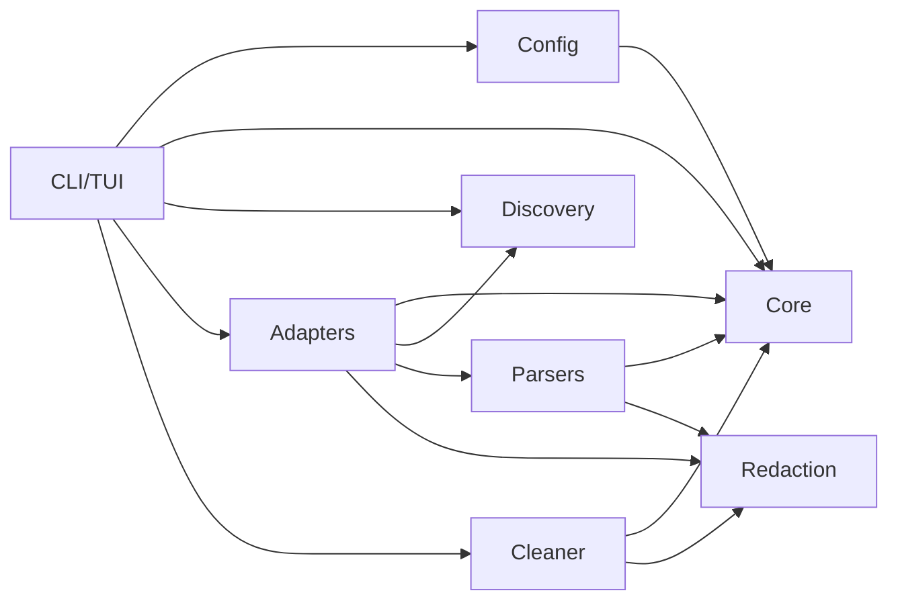

# Modules Overview

VibeHauler is organized around module contracts. Each module should be small enough to test independently and explicit enough that app-specific cleanup rules cannot leak into generic code.

## Module Graph

## Modules

| Module | Doc | Primary Job |
|---|---|---|
| CLI | [cli.md](./cli.md) | TUI shell, output, confirmations |
| Core | [core.md](./core.md) | shared models, risk engine, plan builder |
| Discovery | [discovery.md](./discovery.md) | cross-platform roots and app instances |
| Adapters | [adapters.md](./adapters.md) | app-specific inventory/session extraction |
| Parsers | [parsers.md](./parsers.md) | format readers for JSONL, SQLite, LevelDB, Markdown |
| Cleaner | [cleaner.md](./cleaner.md) | backup, trash, quarantine, manifest, restore |
| Redaction | [redaction.md](./redaction.md) | secret masking and preview safety |
| Config | [config.md](./config.md) | config discovery, defaults, validation |
| Fixtures/Testing | [fixtures-testing.md](./fixtures-testing.md) | fake homes, snapshots, integration tests |

## Implementation Order

1. Core data model and risk levels.
2. Config and path discovery.
3. TUI startup shell.
4. Adapter registry with empty adapters.
5. JSONL parsers for Claude, Codex, Gemini; protective adapters for Cursor, Cherry Studio, DeepChat.
6. App selection and safe cleanup screens.
7. Plan builder and manifest contracts.
8. Cleaner backup, trash, manifest, and TUI restore guidance.
9. SQLite protective reports for v0.2 desktop clients.
10. Release packaging.

The first implementation milestone should be intentionally boring: parse startup flags, discover fixture roots, and render deterministic TUI screens.
