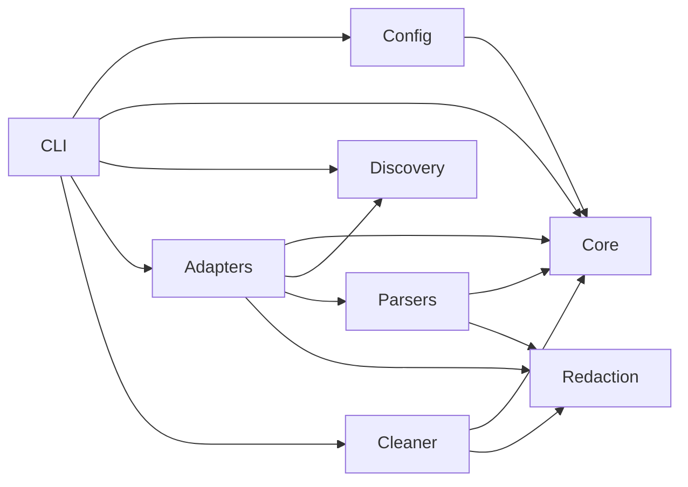

# Modules Overview

VibeHauler is organized around module contracts. Each module should be small enough to test independently and explicit enough that app-specific cleanup rules cannot leak into generic code.

## Module Graph

## Modules

| Module | Doc | Primary Job |
|---|---|---|
| CLI | [cli.md](./cli.md) | command UX, output, confirmations |
| Core | [core.md](./core.md) | shared models, risk engine, plan builder |
| Discovery | [discovery.md](./discovery.md) | cross-platform roots and app instances |
| Adapters | [adapters.md](./adapters.md) | app-specific inventory/session extraction |
| Parsers | [parsers.md](./parsers.md) | format readers for JSONL, SQLite, LevelDB, Markdown |
| Cleaner | [cleaner.md](./cleaner.md) | backup, trash, quarantine, manifest, restore |
| Redaction | [redaction.md](./redaction.md) | secret masking and preview safety |
| Config | [config.md](./config.md) | config discovery, defaults, validation |
| Fixtures/Testing | [fixtures-testing.md](./fixtures-testing.md) | fake homes, snapshots, integration tests |

## Implementation Order

1. Core data model and risk levels.
2. Config and path discovery.
3. CLI command skeleton.
4. Adapter registry with empty adapters.
5. JSONL/Markdown parsers for Claude, Codex, Gemini, Aider.
6. Scan inventory and risk report.
7. Plan builder.
8. Cleaner dry-run, backup, trash, manifest, restore.
9. SQLite/LevelDB protective reads for desktop clients.
10. Release packaging.

The first implementation milestone should be intentionally boring: parse flags, discover fixture roots, and print deterministic reports.
